[![Contributors][contributors-shield]][contributors-url]
[![Forks][forks-shield]][forks-url]
[![Stargazers][stars-shield]][stars-url]
[![Issues][issues-shield]][issues-url]
[![MIT License][license-shield]][license-url]

[contributors-shield]: https://img.shields.io/github/contributors/J-o-n-a-s/Blockly_Games.svg?style=for-the-badge
[contributors-url]: https://github.com/J-o-n-a-s/Blockly_Games/graphs/contributors
[forks-shield]: https://img.shields.io/github/forks/J-o-n-a-s/Blockly_Games.svg?style=for-the-badge
[forks-url]: https://github.com/J-o-n-a-s/Blockly_Games/network/members
[stars-shield]: https://img.shields.io/github/stars/J-o-n-a-s/Blockly_Games.svg?style=for-the-badge
[stars-url]: https://github.com/J-o-n-a-s/Blockly_Games/stargazers
[issues-shield]: https://img.shields.io/github/issues/J-o-n-a-s/Blockly_Games.svg?style=for-the-badge
[issues-url]: https://github.com/J-o-n-a-s/Blockly_Games/issues
[license-shield]: https://img.shields.io/github/license/J-o-n-a-s/Blockly_Games.svg?style=for-the-badge
[license-url]: https://github.com/J-o-n-a-s/Blockly_Games/blob/master/LICENSE

# Blockly Games
Resolvendo os desafios do Blockly Games.

-------------

**Instruções**

 - *Fork* este repositório;
 - Clone seu repositório *forked*;
 - Adicione seus scripts;
 - *Commit & Push*;
 - Crie um *pull request*;
 - Dê uma estrela para este repositório;
 - Aguarde que o seu *pull request* solicitado vire um *merge*;
 - Comemore, seu primeiro passo para o mundo de código aberto e continue contribuindo.

## Introdução

Este repositório tem somente o propósito de apresentar algumas soluções para o site Blockly Games. Este site ajuda o futuros programadores, ou como eles mesmo citam "... os programadores do amanhã.", aprenderem a pensar demonstrando assim uma forma lúdica de aprenderem lógica de programação.

Na imagem a seguir são apresentados os tópicos disponibilizados para a resolução (01/11/2023).

## Quebra-Cabeça

Este é um tópico apenas introdutório, bem simples, servindo apenas para nos habituarmos com as funcionalidades mais básicas, possuindo apenas um único desafio, mostrado na imagem a seguir:

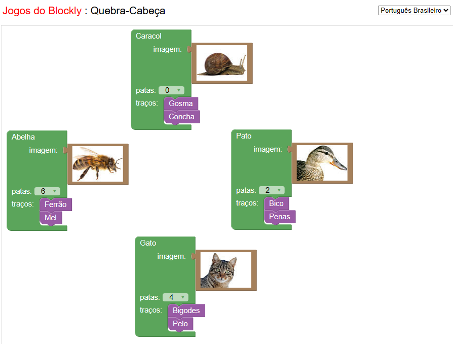

## Labirinto

Este tópico é composto de 10 desafios. O seu grau de complexidade aumenta conforme os níveis vão passando. Sendo o primeiro nível mais simples e o décimo mais complexo. Cada desafio apresenta uma imagem com um ponto de partida e um de chegada, é necessário utilizar os blocos de controle disponibilizados e agrupá-los, ordená-los de formas específicas com o intuito de atingir o objetivo final do desafio. Ao final, com a correta resolução e execução do desafio, é apresentado o código equivalente em linguagem JavaScript.

#### Labirinto - Nível 01

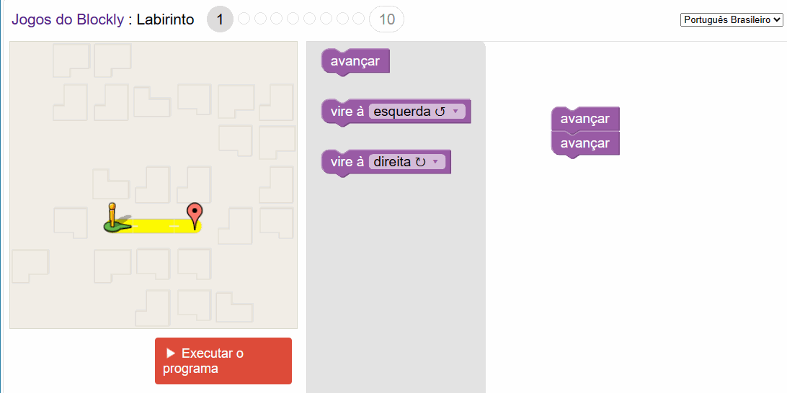

#### Labirinto - Nível 02

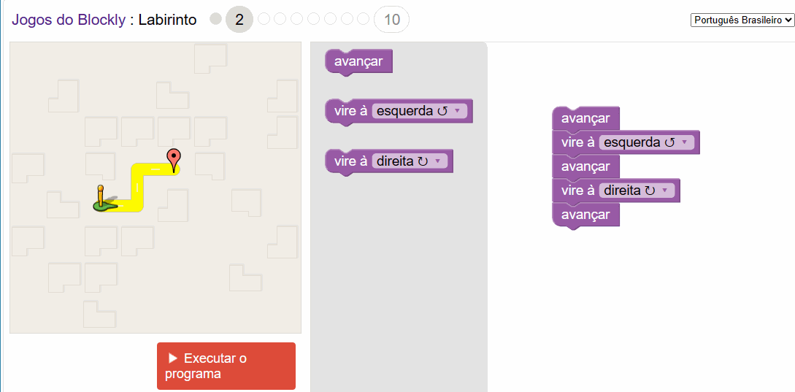

#### Labirinto - Nível 03

#### Labirinto - Nível 04

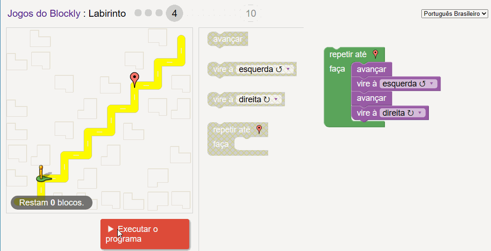

#### Labirinto - Nível 05

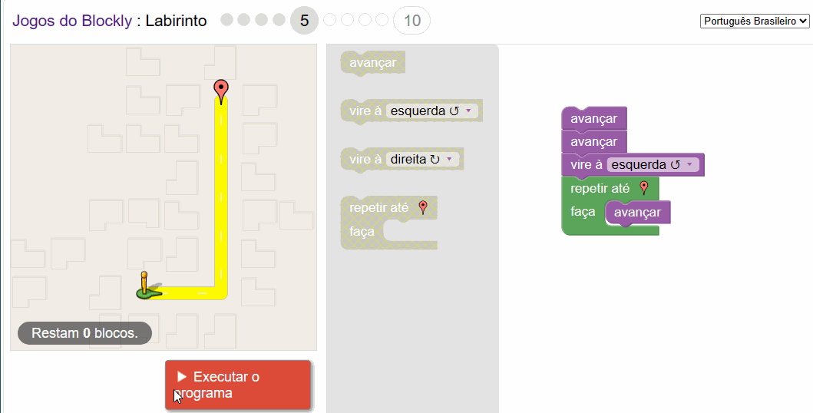

#### Labirinto - Nível 06

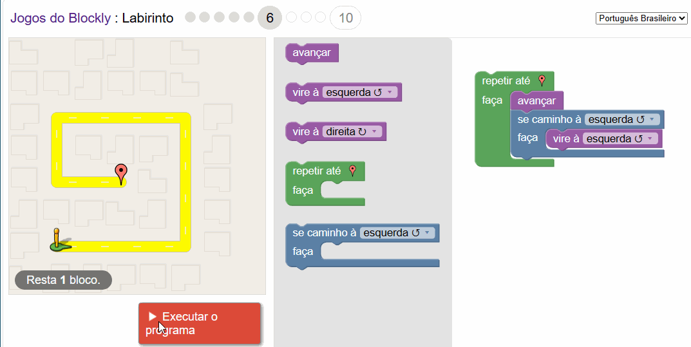

#### Labirinto - Nível 07

#### Labirinto - Nível 08

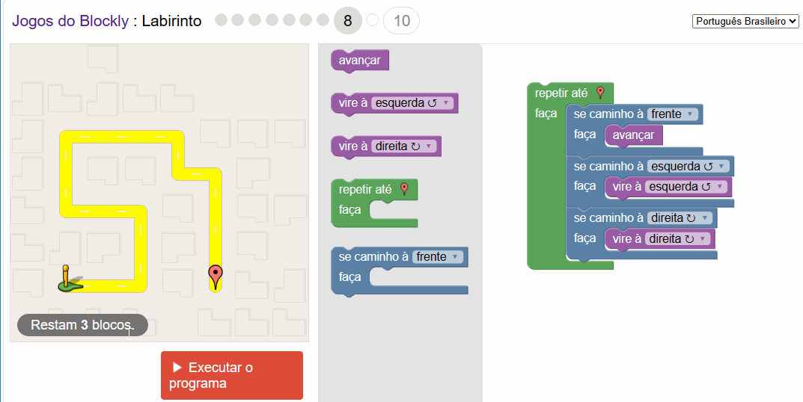

#### Labirinto - Nível 09

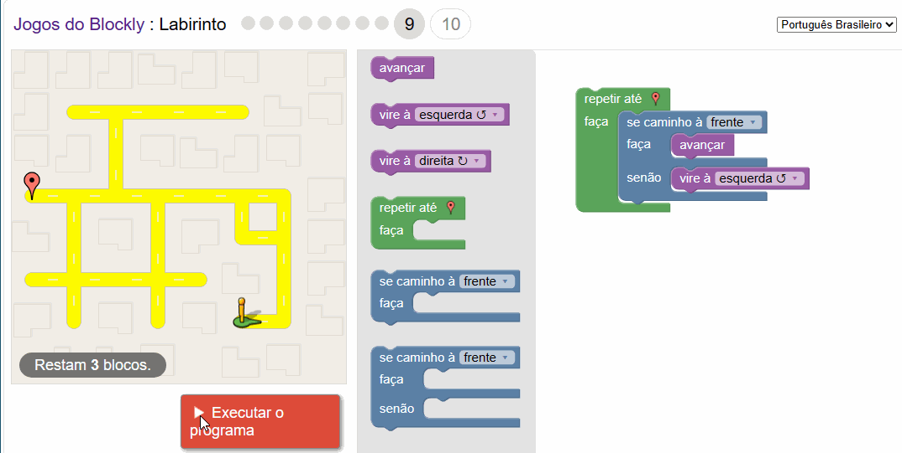

#### Labirinto - Nível 10

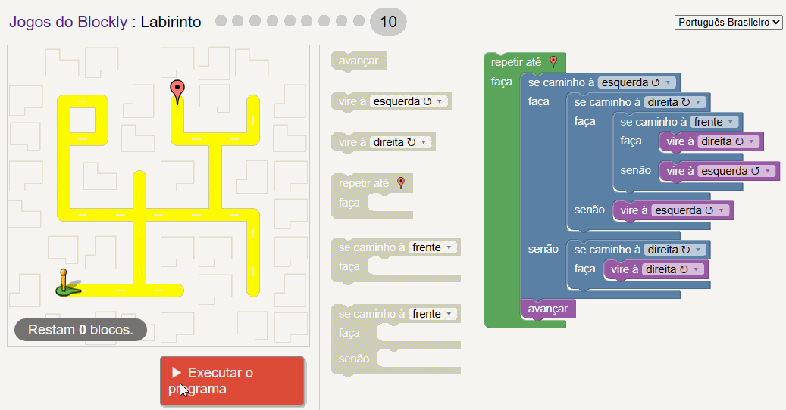

## Pássaro

Este tópico é composto de 10 desafios. O seu grau de complexidade aumenta conforme os níveis vão passando. Sendo o primeiro nível mais simples e o décimo mais complexo. Cada desafio apresenta uma imagem com um pássaro e o seu ninho, em alguns casos basta levá-lo apenas ao ninho e em outros ele deve antes pegar uma minhoca. É necessário utilizar os blocos de controle disponibilizados e agrupá-los, ordená-los de formas específicas com o intuito de atingir o objetivo final do desafio. Ao final, com a correta resolução e execução do desafio, é apresentado o código equivalente em linguagem JavaScript.

#### Pássaro - Nível 01

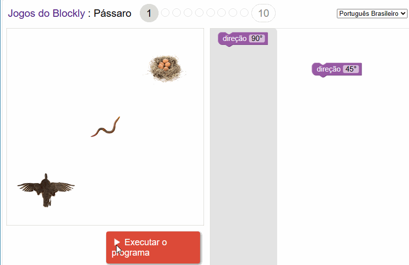

#### Pássaro - Nível 02

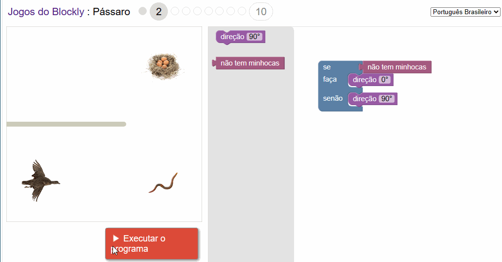

#### Pássaro - Nível 03

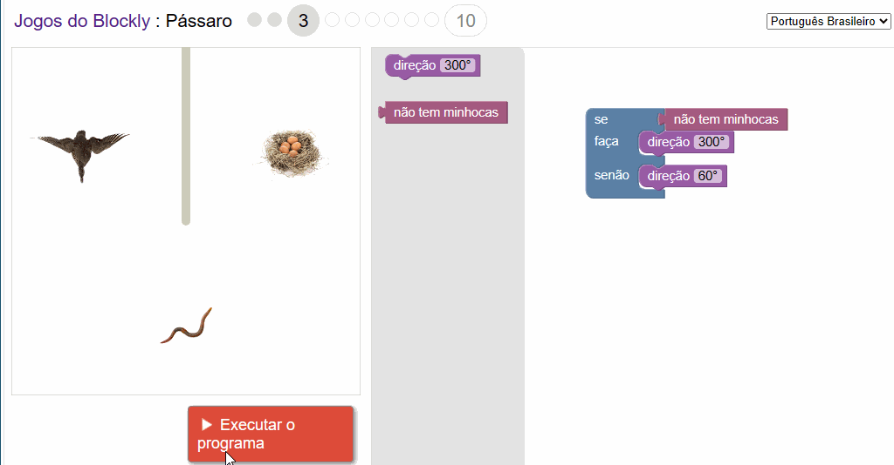

#### Pássaro - Nível 04

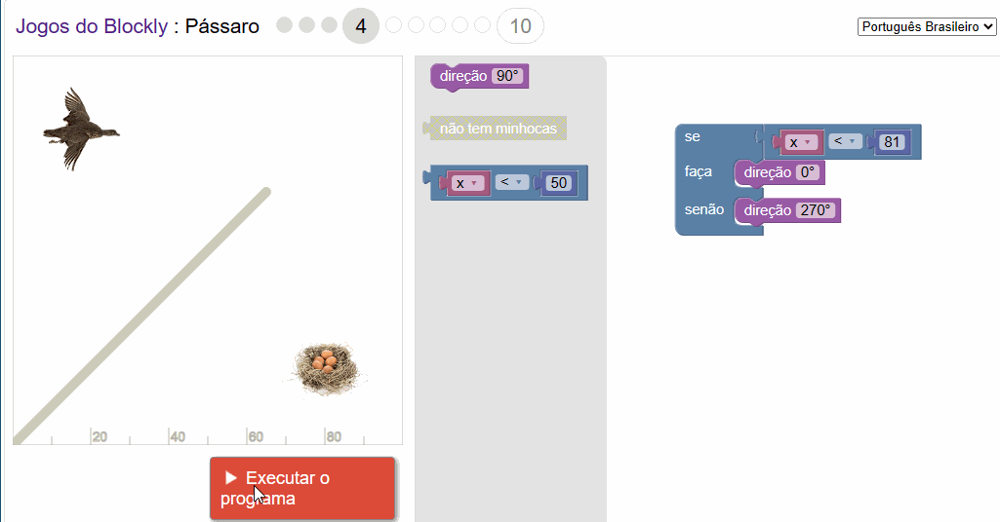

#### Pássaro - Nível 05

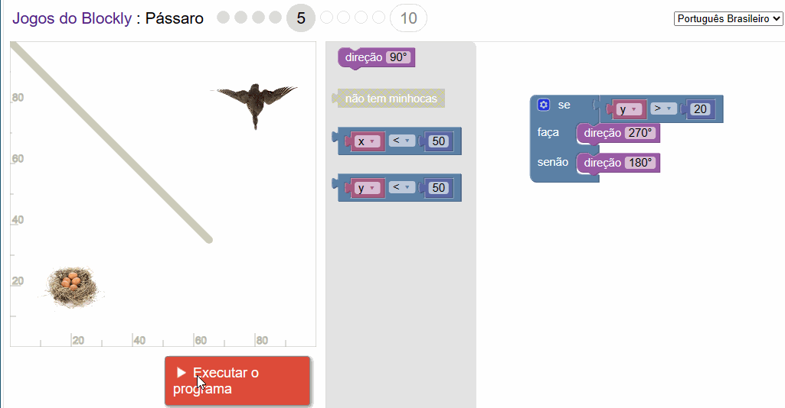

#### Pássaro - Nível 06

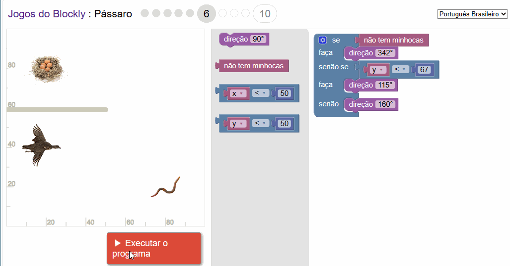

#### Pássaro - Nível 07

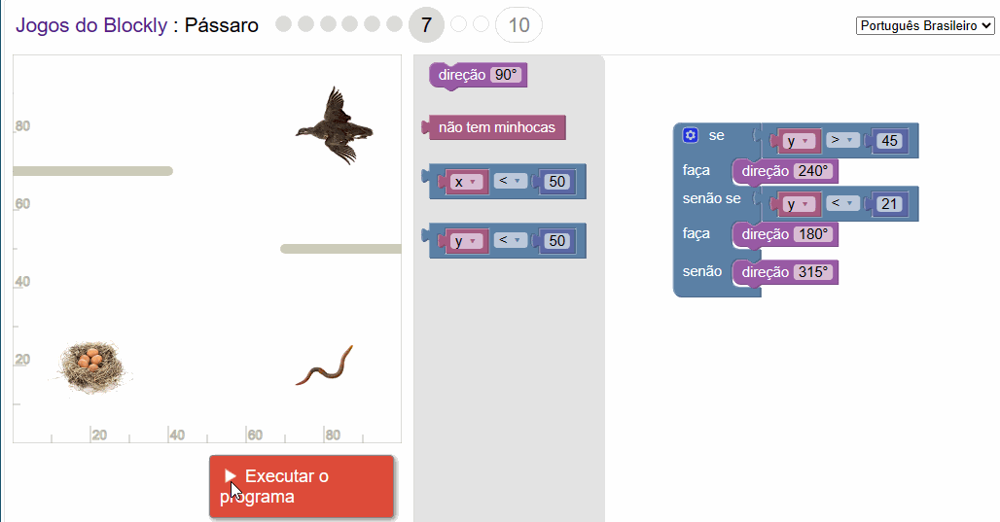

#### Pássaro - Nível 08

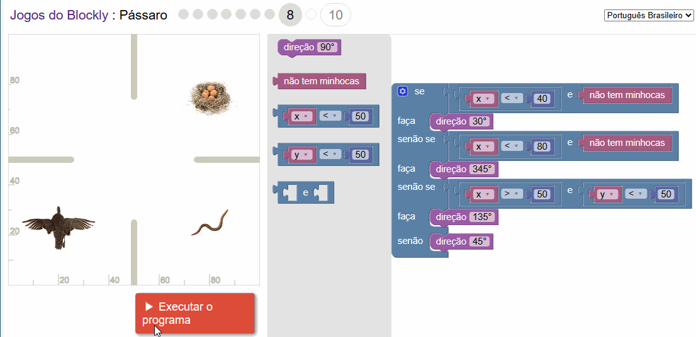

#### Pássaro - Nível 09

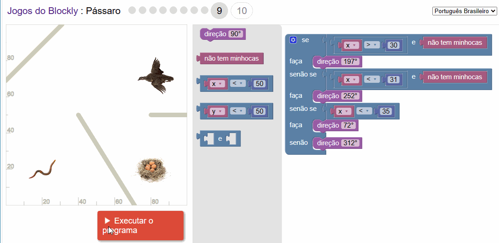

#### Pássaro - Nível 10

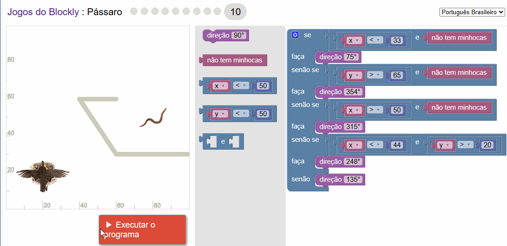

## Licença

MIT License
