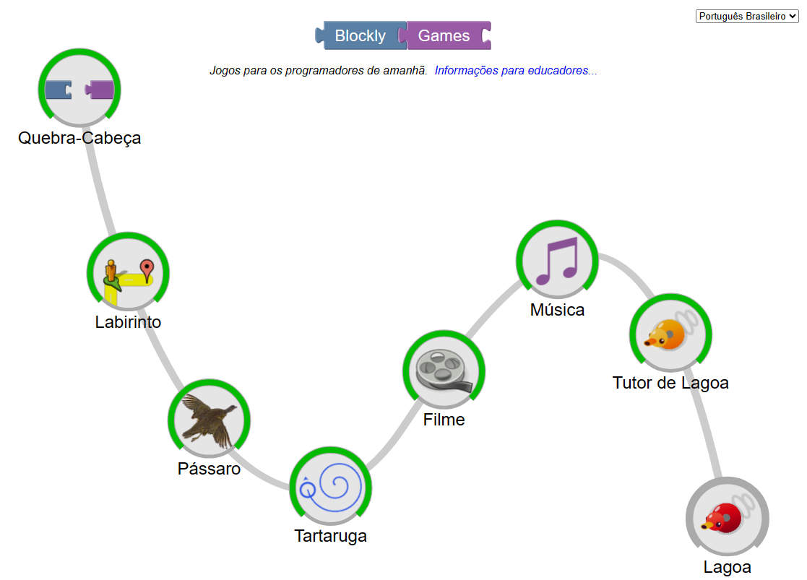

[![Contributors][contributors-shield]][contributors-url]
[![Forks][forks-shield]][forks-url]
[![Stargazers][stars-shield]][stars-url]
[![Issues][issues-shield]][issues-url]
[![MIT License][license-shield]][license-url]

[contributors-shield]: https://img.shields.io/github/contributors/J-o-n-a-s/BreadcrumbsBlockly_Games.svg?style=for-the-badge
[contributors-url]: https://github.com/J-o-n-a-s/BreadcrumbsBlockly_Games/graphs/contributors
[forks-shield]: https://img.shields.io/github/forks/J-o-n-a-s/BreadcrumbsBlockly_Games.svg?style=for-the-badge
[forks-url]: https://github.com/J-o-n-a-s/BreadcrumbsBlockly_Games/network/members
[stars-shield]: https://img.shields.io/github/stars/J-o-n-a-s/BreadcrumbsBlockly_Games.svg?style=for-the-badge
[stars-url]: https://github.com/J-o-n-a-s/BreadcrumbsBlockly_Games/stargazers
[issues-shield]: https://img.shields.io/github/issues/J-o-n-a-s/BreadcrumbsBlockly_Games.svg?style=for-the-badge
[issues-url]: https://github.com/J-o-n-a-s/BreadcrumbsBlockly_Games/issues
[license-shield]: https://img.shields.io/github/license/J-o-n-a-s/BreadcrumbsBlockly_Games.svg?style=for-the-badge
[license-url]: https://github.com/J-o-n-a-s/BreadcrumbsBlockly_Games/blob/master/LICENSE

# Blockly_Games
Resolvendo Blockly Games

-------------

**Instruções**

 - *Fork* este repositório;
 - Clone seu repositório *forked*;
 - Adicione seus scripts;
 - *Commit & Push*;
 - Crie um *pull request*;
 - Dê uma estrela para este repositório;
 - Aguarde que o seu *pull request* solicitado vire um *merge*;
 - Comemore, seu primeiro passo para o mundo de código aberto e continue contribuindo.

## Introdução

Este repositório tem somente o propósito de apresentar algumas soluções para o site Blockly Games. Na imagem a seguir são apresentados os tópicos disponibilizados para a resolução (01/11/2023).

